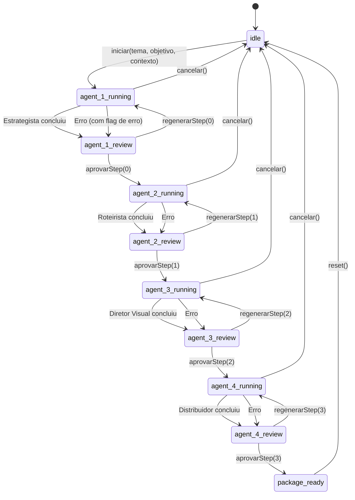

# Fluxo de Estado — State Machine

> A state machine completa do pipeline de produção, definida em `usePipeline.js`.

Ver também: [[CLAUDE]] · [[agentes]] · [[arquitetura]]

---

## Diagrama da State Machine



---

## Estados

| Status              | Significado                                      | UI Renderizada         |
| ------------------- | ------------------------------------------------ | ---------------------- |
| `idle`              | Nenhuma produção em andamento                    | `StartForm`            |
| `agent_1_running`   | Estrategista processando (streaming ativo)       | `AgentLoading`         |
| `agent_1_review`    | Estrategista concluiu, aguarda review humano     | `EstrategistaView`     |
| `agent_2_running`   | Roteirista processando                           | `AgentLoading`         |
| `agent_2_review`    | Roteirista concluiu, aguarda review humano       | `RoteiristaView`       |
| `agent_3_running`   | Diretor Visual processando                       | `AgentLoading`         |
| `agent_3_review`    | Diretor Visual concluiu, aguarda review humano   | `DiretorVisualView`    |
| `agent_4_running`   | Distribuidor processando                         | `AgentLoading`         |
| `agent_4_review`    | Distribuidor concluiu, aguarda review humano     | `DistribuidorView`     |
| `package_ready`     | Todos os 4 agentes aprovados                     | `PacoteFinal`          |

---

## Shape do Estado

```js
{
  status: 'idle',        // string — estado atual da máquina
  currentStep: -1,       // -1 = formulário, 0-3 = agentes
  error: null,           // string | null — mensagem de erro
  isStreaming: false,     // boolean — streaming ativo do Gemini
  streamingText: '',     // string — texto acumulado durante streaming

  inputs: {
    tema: '',
    objetivo: '',
    contextoExtra: '',
  },

  rawOutputs: {          // texto bruto de cada agente
    estrategia: null,
    roteiro: null,
    visuais: null,
    distribuicao: null,
  },

  parsedOutputs: {       // dados estruturados (parseados por parser.js)
    estrategia: null,    // objeto com campos YAML
    cenas: null,         // array de cenas
    tts: null,           // string do script TTS
    metaRoteiro: null,   // { duracaoTotal, totalCenas }
    visuais: null,       // array de visuais por cena
    consistencia: null,  // string do guia de consistência
    distribuicao: null,  // objeto { tiktok, instagram, youtube, geral }
  },
}
```

---

## Ações (Dispatchers)

### `iniciar(tema, objetivo, contextoExtra)`

Inicia uma nova produção. Reseta o estado para `INITIAL_STATE`, salva os inputs, e dispara o Agente 1 (Estrategista) com um `setTimeout(100ms)` para garantir que o state foi atualizado.

### `aprovarStep(stepIndex)`

Aprova o resultado do agente atual e dispara o próximo:

```
aprovarStep(0) → executarRoteirista()
aprovarStep(1) → executarDiretorVisual()
aprovarStep(2) → executarDistribuidor()
aprovarStep(3) → status = 'package_ready'
```

### `regenerarStep(stepIndex)`

Re-executa o agente do step indicado. O output anterior é descartado assim que o novo output chega.

### `cancelar()` / `reset()`

Ambos definem `abortRef.current = true` e resetam para `INITIAL_STATE`. O `abortRef` previne que callbacks de streaming em voo alterem o state após o cancelamento.

---

## Fluxo de Execução de um Agente

```
executarAgente(agentId, promptFn, promptArgs, outputKey, stepIndex, parseFn)
│
├── 1. Define status = 'agent_N_running', isStreaming = true
│
├── 2. Chama promptFn(promptArgs) → { system, user }
│
├── 3. Chama runAgent(agentId, system, user, onChunk)
│   │
│   └── onChunk(chunk, fullText):
│       └── setState({ streamingText: fullText })
│
├── 4. Resultado obtido:
│   ├── parseFn(resultado) → dados estruturados
│   ├── rawOutputs[outputKey] = resultado
│   ├── parsedOutputs = { ...prev, ...parsed }
│   └── status = 'agent_N_review'
│
└── 5. Em caso de ERRO:
    ├── status = 'agent_N_review' (mantém no review)
    └── error = error.message
```

---

## Importação Dinâmica dos Parsers

Os parsers são importados via `dynamic import()` no momento da execução de cada agente:

```js
const { parseEstrategia } = await import('../services/parser.js');
```

Isso é feito para **code splitting** — os parsers só são carregados quando necessários.

---

## Diagrama de Sequência

```
Usuário          App.jsx         usePipeline       Gemini         parser.js
  │                │                │                │                │
  │── preenche ──▶│                │                │                │
  │   formulário   │── iniciar() ─▶│                │                │
  │                │                │── runAgent() ─▶│                │
  │                │                │◀── chunks ────│                │
  │                │◀── render ────│  (streaming)   │                │
  │   (loading)    │                │◀── resultado ──│                │
  │                │                │── parseFn() ──────────────────▶│
  │                │                │◀────── parsed ─────────────────│
  │                │◀── render ────│                │                │
  │   (review)     │                │                │                │
  │── Aprovar ───▶│── aprovar() ──▶│                │                │
  │                │                │── runAgent() ─▶│  (próx agente) │
  │                │                │    ...          │                │
  │                │                │                │                │
  │                │◀── render ────│ (package_ready) │               │
  │   (pacote)     │                │                │                │
```

---

## Concorrência e Abort

- Um `useRef(abortRef)` controla cancelamento
- Se `abortRef.current === true`, callbacks de streaming são ignorados e o resultado é descartado
- Não há debounce — cada ação (aprovar/regenerar) é atômica
- O usuário não pode disparar dois agentes em paralelo; o pipeline é estritamente sequencial
